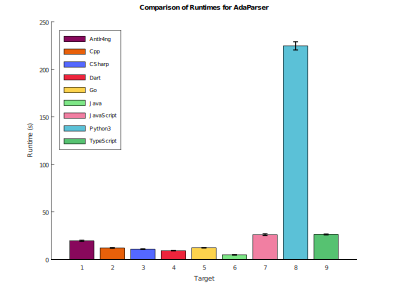

# Ada 2012 ANTLR Grammar

This is an ANTLR4 grammar for the Ada 2012 programming language,
based on the [Ada Reference Manual](http://www.ada-auth.org/standards/12rm/html/RM-TOC.html).
The grammar is organized into two files:
AdaLexer.g4 for lexical analysis and AdaParser.g4 for parsing.
Parser rules are ordered to correspond with the sections in the [Syntax Summary](http://www.ada-auth.org/standards/12rm/html/RM-P.html).

## Symbol Table for Disambiguation

The Ada grammar contains inherent ambiguities that cannot be resolved through syntax alone. The most significant involves qualified expressions and type conversions: when the parser encounters an identifier followed by `'(`, it cannot determine from context alone whether this is a qualified expression (requiring a type name) or an attribute applied to an object. For example:

```ada
X := Foo'(1, 2, 3);
```

This could be parsed as either:
- A qualified expression producing an aggregate of type `Foo` (if `Foo` is a type name)
- An attribute reference applying the attribute `'(...)` to the object `Foo` (if `Foo` is a variable)

Similarly, `Foo(Y)` could be a type conversion (if `Foo` is a type) or a function/procedure call (if `Foo` is a subprogram). And `(X, Y)` could be a parenthesized expression or a positional aggregate depending on the expected type context.

To resolve such ambiguities, this grammar implements a symbol table that tracks type definitions as they are parsed. Semantic predicates in the parser (`IsTypeName` and `IsAggregate`) query the symbol table to make context-sensitive parsing decisions. The symbol table maintains proper scoping, pushing and popping block scopes as compound statements and declarative regions are entered and exited.

### Cross-File Symbol Resolution (with-clause import)

When parsing a file that contains `with Foo;`, the parser automatically locates and parses `foo.ads` to import its visible symbols. This follows the GNAT file naming convention:

- Convert the package name to lowercase
- Replace dots with hyphens (for child packages)
- Append `.ads` for specifications

Examples: `Helpers` becomes `helpers.ads`, `Ada.Text_IO` becomes `ada-text_io.ads`.

The parser searches for `.ads` files in the following order:
1. The directory of the file currently being parsed
2. Directories specified by `--I<path>` options, in order given

Parsed package symbols are cached so the same package is not re-parsed for other files. Cycle detection prevents infinite recursion when packages reference each other.

## Options

The parser base class implements the following command-line options:

| Option | Description |
|--------|-------------|
| `--I<path>` | Add a directory to the search path for `.ads` files when resolving `with` clauses. Can be specified multiple times. Example: `--I../src --I../lib` |
| `--debug` | Enable debug output for semantic predicates, symbol table operations, and with-clause imports. Output goes to stderr. |
| `--no-semantics` | Disable all semantic predicates. Each predicate returns `true`, effectively disabling symbol table lookups for parsing decisions. |
| `--no-semantics=Func1,Func2,...` | Disable only the specified semantic predicates. Available predicates: `IsTypeName`, `IsAggregate`. |
| `--output-symbol-table` | Output the symbol table to stderr after parsing completes. Shows all non-predefined symbols with their classification and source location. |
| `--output-applied-occurrences` | Output applied occurrences (identifier references) to stderr as they are resolved. |

## Peformance



Runtime of `examples/*.c` on AMD Ryzen 7 2700 Eight-Core Processor; 16GB DDR4;
Samsung SSD 990 EVO Plus 2TB;
Windows: Version 10.0.26200.7623 (this is a Windows 11 Insider Preview build); 
.NET SDK: 10.0.102. Sample size 20.

## Reference
* [pldb](http://pldb.info/concepts/ada)
* http://www.ada-auth.org/acats.html
* https://docs.adacore.com/live/wave/arm12/pdf/arm12/arm-12.pdf
