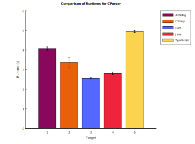

# C Language Grammar

## Introduction

This is an ANTLR4 grammar for the C programming language, based on the ISO/IEC 9899:2024 specification (C23). The grammar is organized into two files: `CLexer.g4` for lexical analysis and `CParser.g4` for parsing. Parser rules are ordered to correspond with the sections in the ISO C specification.

### Preprocessor Integration

Unlike many C grammars that assume pre-processed input, this grammar integrates directly with native C preprocessors (GCC, Clang, or Visual Studio). This integration is essential because C programs typically rely on header files (`#include`) that define types, macros, and declarations. Without preprocessing, the parser would lack the type information necessary to correctly parse the source code.

The lexer base class (`CLexerBase`) automatically invokes the selected preprocessor before tokenization begins. By default, the grammar uses `gcc -E` for preprocessing, but this can be configured via command-line options (see Options below). The `--nopp` option allows parsing of already-preprocessed files.

### Symbol Table for Disambiguation

The C language grammar contains inherent ambiguities that cannot be resolved through syntax alone. The most significant is the "typedef problem": when the parser encounters an identifier, it cannot determine from context alone whether it represents a type name (from a `typedef`) or a variable/function name. For example:

```c
foo * bar;
```

This could be parsed as either:
- A declaration of `bar` as a pointer to type `foo` (if `foo` is a typedef)
- A multiplication expression of `foo` times `bar` (if `foo` is a variable)

To resolve such ambiguities, this grammar implements a symbol table that tracks type definitions as they are parsed. Semantic predicates in the parser (such as `IsTypedefName`, `IsTypeSpecifier`, and `IsCast`) query the symbol table to make context-sensitive parsing decisions. The symbol table maintains proper scoping, pushing and popping block scopes as compound statements are entered and exited.

### Multi-Target Support

The grammar includes target-specific implementations for multiple languages: Java, TypeScript, C#, Dart, and Antlr4ng. Each target provides its own implementation of `CLexerBase` and `CParserBase` with the preprocessor integration and symbol table logic.

### GNU/GCC Extensions

In addition to standard C23, this grammar supports common GNU/GCC extensions including:
- GNU-style attributes (`__attribute__`)
- Inline assembly (`asm`, `__asm__`)
- Additional type specifiers (`__int128`, `_Float128`, etc.)
- Statement expressions (`({ ... })`)
- Label addresses (`&&label`)
- Various built-in functions (`__builtin_va_arg`, `__builtin_offsetof`, etc.)

Visual C extensions such as calling conventions (`__cdecl`, `__stdcall`, etc.) and `__declspec` are also supported.

## Options

The parser and lexer base classes implement the following command-line options:

### Preprocessor Options (CLexerBase)

These options control which C preprocessor is used before parsing:

| Option | Description |
|--------|-------------|
| `--gcc` | Use the GCC preprocessor (`gcc -E`). This is the default if no preprocessor is specified. |
| `--clang` | Use the Clang preprocessor (`clang -E`). |
| `--vsc` | Use the Visual Studio C preprocessor (`cl.exe /E`). Windows only. |
| `--nopp` | Skip preprocessing entirely. Use this if the input is already preprocessed. |
| `--D<macro>[=<value>]` | Define a preprocessor macro. Passed to the preprocessor as `-D<macro>[=<value>]`. Can be specified multiple times. Example: `--DDEBUG=1` |
| `--I<path>` | Add a directory to the include search path. Passed to the preprocessor as `-I<path>`. Can be specified multiple times. Example: `--I/usr/local/include` |

### Parser Options (CParserBase)

These options control semantic predicates and symbol table output:

| Option | Description |
|--------|-------------|
| `--debug` | Enable debug output for semantic predicates and symbol table operations. |
| `--no-semantics` | Disable all semantic predicates. Each predicate returns `true`, effectively disabling symbol table lookups for parsing decisions. |
| `--no-semantics=Func1,Func2,...` | Disable only the specified semantic predicates. Available predicates: `IsAlignmentSpecifier`, `IsAtomicTypeSpecifier`, `IsAttributeDeclaration`, `IsAttributeSpecifier`, `IsAttributeSpecifierSequence`, `IsDeclaration`, `IsDeclarationSpecifier`, `IsTypeSpecifierQualifier`, `IsEnumSpecifier`, `IsFunctionSpecifier`, `IsStatement`, `IsStaticAssertDeclaration`, `IsStorageClassSpecifier`, `IsStructOrUnionSpecifier`, `IsTypedefName`, `IsTypeofSpecifier`, `IsTypeQualifier`, `IsTypeSpecifier`, `IsCast`, `IsNullStructDeclarationListExtension`. |
| `--output-symbol-table` | Output the symbol table to stderr after parsing completes. Shows all non-predefined symbols with their classification and source location. |
| `--output-applied-occurrences` | Output applied occurrences (identifier references) to stderr as they are resolved. Each line shows the applied occurrence location and its corresponding defining occurrence location. |

## Rule Name Mapping

The following table maps the EBNF nonterminal names from the ISO C specification to their corresponding ANTLR4 rule names in this grammar. Lexer rules are indicated with `fragment` for internal rules or by their capitalized names. Empty cells in the ANTLR4 column indicate ISO C constructs that are either handled implicitly, combined into other rules, or not applicable to this grammar (such as preprocessor directives which are handled externally).

| PDF_EBNF_Nonterminal | ANTLR4_Rule | ISO C Rule |
|----------------------|-------------|------------|
|  | compilationUnit |  |
| token |  | 6.4.1 |
| preprocessing-token |  | 6.4.1 |
| keyword |  | 6.4.2 |
| identifier | Identifier | 6.4.3.1 |
| identifier-start | fragment IdentifierNondigit | 6.4.3.1 |
| identifier-continue |  | 6.4.3.1 |
| nondigit | fragment Nondigit | 6.4.3.1 |
| digit | fragment Digit | 6.4.3.1 |
| universal-character-name | fragment UniversalCharacterName | 6.4.4 |
| hex-quad | fragment HexQuad | 6.4.4 |
| constant | constant | 6.4.5.1 |
| integer-constant | fragment IntegerConstant | 6.4.5.2 |
| decimal-constant | fragment DecimalConstant | 6.4.5.2 |
| octal-constant | fragment OctalConstant | 6.4.5.2 |
| hexadecimal-constant | fragment HexadecimalConstant | 6.4.5.2 |
| binary-constant | fragment BinaryConstant | 6.4.5.2 |
| hexadecimal-prefix | fragment HexadecimalPrefix | 6.4.5.2 |
| binary-prefix |  | 6.4.5.2 |
| nonzero-digit | fragment NonzeroDigit | 6.4.5.2 |
| octal-digit | fragment OctalDigit | 6.4.5.2 |
| hexadecimal-digit-sequence |  | 6.4.5.2 |
| hexadecimal-digit | fragment HexadecimalDigit | 6.4.5.2 |
| binary-digit |  | 6.4.5.2 |
| integer-suffix | fragment IntegerSuffix | 6.4.5.2 |
| bit-precise-int-suffix |  | 6.4.5.2 |
| unsigned-suffix | fragment UnsignedSuffix | 6.4.5.2 |
| long-suffix | fragment LongSuffix | 6.4.5.2 |
| long-long-suffix | fragment LongLongSuffix | 6.4.5.2 |
| floating-constant | FloatingConstant | 6.4.5.3 |
| decimal-floating-constant | fragment DecimalFloatingConstant | 6.4.5.3 |
| hexadecimal-floating-constant | fragment HexadecimalFloatingConstant | 6.4.5.3 |
| fractional-constant | fragment FractionalConstant | 6.4.5.3 |
| exponent-part | fragment ExponentPart | 6.4.5.3 |
| sign | fragment Sign | 6.4.5.3 |
| digit-sequence | DigitSequence | 6.4.5.3 |
| hexadecimal-fractional-constant | fragment HexadecimalFractionalConstant | 6.4.5.3 |
| binary-exponent-part | fragment BinaryExponentPart | 6.4.5.3 |
| floating-suffix | fragment FloatingSuffix | 6.4.5.3 |
| enumeration-constant | enumerationConstant | 6.4.5.4 |
| character-constant | CharacterConstant | 6.4.5.5 |
| encoding-prefix | fragment EncodingPrefix | 6.4.5.5 |
| c-char-sequence | fragment CCharSequence | 6.4.5.5 |
| c-char | fragment CChar | 6.4.5.5 |
| escape-sequence | fragment EscapeSequence | 6.4.5.5 |
| simple-escape-sequence | fragment SimpleEscapeSequence | 6.4.5.5 |
| octal-escape-sequence | fragment OctalEscapeSequence | 6.4.5.5 |
| hexadecimal-escape-sequence | fragment HexadecimalEscapeSequence | 6.4.5.5 |
| predefined-constant | predefinedConstant | 6.4.5.6 |
| string-literal | StringLiteral | 6.4.6 |
| s-char-sequence | fragment SCharSequence | 6.4.6 |
| s-char | fragment SChar | 6.4.6 |
| punctuator |  | 6.4.7 |
| header-name |  | 6.4.8 |
| h-char-sequence |  | 6.4.8 |
| h-char |  | 6.4.8 |
| q-char-sequence |  | 6.4.8 |
| q-char |  | 6.4.8 |
| pp-number |  | 6.4.9 |
| primary-expression | primaryExpression | 6.5.2 |
|  | exprList |  |
| generic-selection | genericSelection | 6.5.2.1 |
| generic-assoc-list | genericAssocList | 6.5.2.1 |
| generic-association | genericAssociation | 6.5.2.1 |
| postfix-expression | postfixExpression | 6.5.3.1 |
| argument-expression-list | argumentExpressionList | 6.5.3.1 |
| compound-literal |  | 6.5.3.1 |
| storage-class-specifiers |  | 6.5.3.6 |
| unary-expression | unaryExpression | 6.5.4.1 |
| unary-operator |  | 6.5.4.1 |
| cast-expression | castExpression | 6.5.5 |
| multiplicative-expression | multiplicativeExpression | 6.5.6 |
| additive-expression | additiveExpression | 6.5.7 |
| shift-expression | shiftExpression | 6.5.8 |
| relational-expression | relationalExpression | 6.5.9 |
| equality-expression | equalityExpression | 6.5.10 |
| AND-expression | andExpression | 6.5.11 |
| exclusive-OR-expression | exclusiveOrExpression | 6.5.12 |
| inclusive-OR-expression | inclusiveOrExpression | 6.5.13 |
| logical-AND-expression | logicalAndExpression | 6.5.14 |
| logical-OR-expression | logicalOrExpression | 6.5.15 |
| conditional-expression | conditionalExpression | 6.5.16 |
| assignment-expression | assignmentExpression | 6.5.17.1 |
| assignment-operator |  | 6.5.17.1 |
| expression | expression | 6.5.18 |
| constant-expression | constantExpression | 6.6 |
| declaration | declaration | 6.7.1 |
| declaration-specifiers | declarationSpecifiers | 6.7.1 |
| declaration-specifier | declarationSpecifier | 6.7.1 |
| init-declarator-list | initDeclaratorList | 6.7.1 |
| init-declarator | initDeclarator | 6.7.1 |
| attribute-declaration | attributeDeclaration | 6.7.1 |
| storage-class-specifier | storageClassSpecifier | 6.7.2 |
| type-specifier | typeSpecifier | 6.7.3.1 |
| struct-or-union-specifier | structOrUnionSpecifier | 6.7.3.2 |
| struct-or-union | structOrUnion | 6.7.3.2 |
| member-declaration-list | memberDeclarationList | 6.7.3.2 |
| member-declaration | memberDeclaration | 6.7.3.2 |
| specifier-qualifier-list | specifierQualifierList | 6.7.3.2 |
| type-specifier-qualifier | typeSpecifierQualifier | 6.7.3.2 |
| member-declarator-list | memberDeclaratorList | 6.7.3.2 |
| member-declarator |  | 6.7.3.2 |
| enum-specifier | enumSpecifier | 6.7.3.3 |
| enumerator-list | enumeratorList | 6.7.3.3 |
| enumerator | enumerator | 6.7.3.3 |
| enum-type-specifier | enumTypeSpecifier | 6.7.3.3 |
| atomic-type-specifier | atomicTypeSpecifier | 6.7.3.5 |
| typeof-specifier | typeofSpecifier | 6.7.3.6 |
| typeof-specifier-argument | typeofSpecifierArgument | 6.7.3.6 |
| type-qualifier | typeQualifier | 6.7.4.1 |
| function-specifier | functionSpecifier | 6.7.5 |
| alignment-specifier | alignmentSpecifier | 6.7.6 |
| declarator | declarator | 6.7.7.1 |
| direct-declarator | directDeclarator | 6.7.7.1 |
| array-declarator |  | 6.7.7.1 |
| function-declarator |  | 6.7.7.1 |
| pointer | pointer | 6.7.7.1 |
| type-qualifier-list | typeQualifierList | 6.7.7.1 |
| parameter-type-list | parameterTypeList | 6.7.7.1 |
| parameter-list | parameterList | 6.7.7.1 |
| parameter-declaration | parameterDeclaration | 6.7.7.1 |
| type-name | typeName | 6.7.8 |
| abstract-declarator | abstractDeclarator | 6.7.8 |
| direct-abstract-declarator | directAbstractDeclarator | 6.7.8 |
| array-abstract-declarator |  | 6.7.8 |
| function-abstract-declarator |  | 6.7.8 |
| typedef-name | typedefName | 6.7.9 |
| braced-initializer |  | 6.7.11 |
| initializer | initializer | 6.7.11 |
| initializer-list | initializerList | 6.7.11 |
| designation | designation | 6.7.11 |
| designator-list | designatorList | 6.7.11 |
| designator | designator | 6.7.11 |
| static_assert-declaration | staticAssertDeclaration | 6.7.12 |
| attribute-specifier-sequence | attributeSpecifierSequence | 6.7.13.2 |
| attribute-specifier | attributeSpecifier | 6.7.13.2 |
| attribute-list | attributeList | 6.7.13.2 |
| attribute | attribute | 6.7.13.2 |
| attribute-token | attributeToken | 6.7.13.2 |
| standard-attribute |  | 6.7.13.2 |
| attribute-prefixed-token |  | 6.7.13.2 |
| attribute-prefix |  | 6.7.13.2 |
| attribute-argument-clause | attributeArgumentClause | 6.7.13.2 |
| balanced-token-sequence | balancedTokenSequence | 6.7.13.2 |
| balanced-token | balancedToken | 6.7.13.2 |
| statement | statement | 6.8.1 |
| unlabeled-statement |  | 6.8.1 |
| primary-block |  | 6.8.1 |
| secondary-block |  | 6.8.1 |
| label |  | 6.8.2 |
| labeled-statement | labeledStatement | 6.8.2 |
| compound-statement | compoundStatement | 6.8.3 |
| block-item-list | blockItemList | 6.8.3 |
| block-item | blockItem | 6.8.3 |
| expression-statement | expressionStatement | 6.8.4 |
| selection-statement | selectionStatement | 6.8.5.1 |
| iteration-statement | iterationStatement | 6.8.6.1 |
|  | forCondition |  |
|  | forDeclaration |  |
|  | forExpression |  |
| jump-statement | jumpStatement | 6.8.7.1 |
| translation-unit | translationUnit | 6.9.1 |
| external-declaration | externalDeclaration | 6.9.1 |
| function-definition | functionDefinition | 6.9.2 |
|  | declarationList |  |
| function-body | functionBody | 6.9.2 |
| preprocessing-file |  | 6.10.1 |
| group |  | 6.10.1 |
| group-part |  | 6.10.1 |
| if-section |  | 6.10.1 |
| if-group |  | 6.10.1 |
| elif-groups |  | 6.10.1 |
| elif-group |  | 6.10.1 |
| else-group |  | 6.10.1 |
| endif-line |  | 6.10.1 |
| control-line |  | 6.10.1 |
| text-line |  | 6.10.1 |
| non-directive |  | 6.10.1 |
| lparen |  | 6.10.1 |
| replacement-list |  | 6.10.1 |
| pp-tokens |  | 6.10.1 |
| new-line |  | 6.10.1 |
| identifier-list | identifierList | 6.10.1 |
| pp-parameter |  | 6.10.1 |
| pp-parameter-name |  | 6.10.1 |
| pp-standard-parameter |  | 6.10.1 |
| pp-prefixed-parameter |  | 6.10.1 |
| pp-balanced-token-sequence |  | 6.10.1 |
| pp-balanced-token |  | 6.10.1 |
| embed-parameter-sequence |  | 6.10.1 |
| defined-macro-expression |  | 6.10.1 |
| h-preprocessing-token |  | 6.10.1 |
| h-pp-tokens |  | 6.10.1 |
| header-name-tokens |  | 6.10.1 |
| has-include-expression |  | 6.10.1 |
| has-embed-expression |  | 6.10.1 |
| has-c-attribute-express |  | 6.10.1 |
| va-opt-replacement |  | 6.10.1 |
| standard-pragma |  | 6.10.8 |
| on-off-switch |  | 6.10.8 |
| direction |  | 6.10.8 |
| dec-direction |  | 6.10.8 |
| n-char-sequence |  | 7.24.2.6 |
| n-wchar-sequence |  | 7.31.4.2.2 |
| d-char-sequence |  | 7.24.2.7 |
| d-wchar-sequence |  | 7.31.4.2.3 |
|  | gnuArrayDesignator |  |
|  | asmArgument |  |
|  | asmClobbers |  |
|  | asmDefinition |  |
|  | toplevelAsmArgument |  |
|  | asmOperand |  |
|  | asmOperands |  |
|  | asmQualifier |  |
|  | asmQualifierList |  |
|  | asmStatement |  |
|  | asmStringLiteral |  |
|  | gccDeclaratorExtension |  |
|  | gnuAttribute |  |
|  | gnuAttributeList |  |
|  | gnuAttributes |  |
|  | gnuSingleAttribute |  |
|  | simpleAsmExpr |  |
|  | vcSpecificModifer |  |

## Testing
* [c-testsuite](https://github.com/c-testsuite/c-testsuite)
* [gcc](https://github.com/gcc-mirror/gcc)
* [sqlite](https://github.com/sqlite/sqlite)
* [writing-a-c-compiler-tests](https://github.com/nlsandler/writing-a-c-compiler-tests)

## Peformance



Runtime of `examples/*.c` on AMD Ryzen 7 2700 Eight-Core Processor; 16GB DDR4;
Samsung SSD 990 EVO Plus 2TB;
Windows: Version 10.0.26200.7623 (this is a Windows 11 Insider Preview build); 
.NET SDK: 10.0.102. Sample size 20.

## Reference
* ISO Specification: https://www.iso.org/standard/82075.html
* ISO/ IEC C - Project status and milestones: https://www.open-std.org/jtc1/sc22/wg14/www/projects#9899
* ISO/ IEC JTC1/SC22/WG14 - C, Official home of the working group: https://www.open-std.org/jtc1/sc22/wg14/
* Wikipedia page for C: https://en.wikipedia.org/wiki/C_(programming_language)
