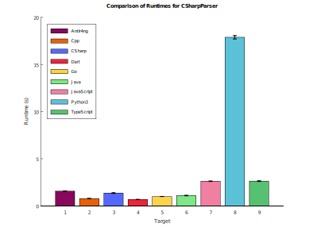

## Summary

C# grammar targeting ECMA-334 7th edition (December 2023), with full support of C# 7.x features and below.
This grammar is based on the v6 grammar and adds C# 7 additions: expression-bodied constructors/destructors/accessors,
`private protected` access modifier, `ref` iteration variables in `foreach`, `stackalloc` in general expression context,
and `ref` returns in anonymous functions.

## Preprocessing

This grammar handles C# preprocessor directives (`#if`, `#elif`, `#else`, `#endif`, `#define`, `#undef`) as part
of normal lexing — no separate preprocessor pass is required. The logic lives entirely in `CSharpLexerBase` via
a `NextToken()` override.

When a `#if` / `#elif` / `#else` condition evaluates to false, the skipped source text is collected into a single
`SKIPPED_SECTION` token emitted on the hidden channel. The parser never sees the false branch. Nested `#if` blocks
are handled correctly by tracking a condition stack and a "was any branch taken" stack.

Supported directives:

| Directive | Behaviour |
|---|---|
| `#define SYM` | Adds `SYM` to the active symbol set (only when in an active section) |
| `#undef SYM` | Removes `SYM` from the active symbol set (only when in an active section) |
| `#if EXPR` | Evaluates `EXPR`; skips the block if false |
| `#elif EXPR` | Evaluates `EXPR` if no prior branch was taken; skips the block if false |
| `#else` | Active if no prior branch was taken |
| `#endif` | Closes the current conditional block |
| `#region` / `#endregion` | Lexed and discarded (no semantic effect) |
| `#line` / `#pragma` / `#warning` / `#error` | Lexed and discarded |

Preprocessor expressions support `!`, `&&`, `||`, `==`, `!=`, parentheses, `true`, `false`, and symbol names.

### Command-Line Options

Symbols can be pre-defined before parsing using the `--D` option (analogous to `csc /define:`):

```
--DSYM              Define a single symbol SYM
--DSYM1;SYM2;SYM3   Define multiple symbols separated by semicolons
```

**Java** (`CSharpLexerBase.java`): pass `--DSYM` as a JVM system property or as a program argument;
the base class reads `System.getProperty("sun.java.command", "")` and scans for `--D` prefixed tokens.

**C#** (`CSharpLexerBase.cs`): pass `--DSYM` on the command line; the base class reads
`Environment.GetCommandLineArgs()` and scans for `--D` prefixed arguments.

Example (C# test harness):

```
Test.exe --DCOMPILERCORE myfile.cs
Test.exe --DDEBUG;TRACE myfile.cs
```

### `--no-semantics`

The parser uses one semantic predicate, `IsLocalVariableDeclaration()`, to disambiguate
`var x = ...` (implicitly-typed local) from a type named `var`. Passing `--no-semantics`
disables this predicate (it returns `true` unconditionally), which lets the parser run
without any context-sensitive logic — useful for quick batch testing or fuzzing.

```
--no-semantics                           Disable all semantic predicates
--no-semantics=IsLocalVariableDeclaration  Disable a specific predicate by name
```

**Java**: pass as a JVM system property: `-Dno-semantics` is not used here; instead pass
`--no-semantics` in `sun.java.command` (i.e. as a normal program argument to the test harness).

**C#**: pass on the command line to the test harness:

```
Test.exe --no-semantics myfile.cs
```

## Grammar Symbol Mapping

See [grammar-symbol-mapping.md](grammar-symbol-mapping.md) for the full mapping between ANTLR4 rule names
and their corresponding symbols in the ECMA-334 7th edition specification.

## Reference
* [pldb](http://pldb.info/concepts/csharp)
* [ECMA 334](https://ecma-international.org/publications-and-standards/standards/ecma-334/)

## Performance



Runtime of `examples/*.cs` on AMD Ryzen 7 2700 Eight-Core Processor; 16GB DDR4;
Samsung SSD 990 EVO Plus 2TB;
Windows: Version 10.0.26200.7623 (this is a Windows 11 Insider Preview build); 
.NET SDK: 10.0.102. Sample size 20.

Parse of `testing/roslyn/src/**/*.cs` is 76000 +/- 1000 tokens per second (SD). Sample size 5, port CSharp. 13287206 tokens.

## License

MIT
