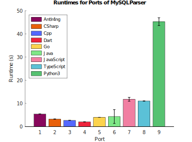

# Oracle's MySQL Grammar

## General

This parser grammar is derived from the official Oracle grammar posted here in original/, which is derived from sources in the MySQL Shell for VS Code extension. 

https://github.com/mysql/mysql-shell-plugins/tree/8928ada7d9e37a4075291880738983752b315fee/gui/frontend/src/parsing/mysql

This grammar is set to recognize version "8.0.20".

Includes updates to commit https://github.com/mysql/mysql-shell-plugins/commit/d0271b1244d9686c30ce95bae92f4cf4c135d36d.

## License

* [BSD3](https://opensource.org/license/bsd-3-clause)

## Target Agnostic

This grammar is "target agnostic". Unaltered, the .g4 files will not work for Antlr4ng, Cpp, Go, and Python3. You will need to first run `python transformGrammar.py` provided in the target-specific directory. The script modifies the .g4 files for the port.

## Modifying this grammar

This grammar is current hand-written. The plan is to generate the ports directly from the sources at https://github.com/mysql/mysql-shell-plugins.

## Issues

* The grammar is ambiguous, but generally performs well, except for bitrix_queries_cut.sql, which contains ~3000 ambiguities.

## Performance

