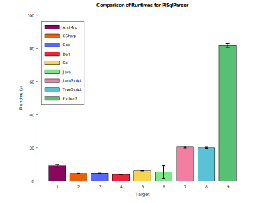

# PL/SQL grammar

This grammar is for recognizing the latest version of PL/SQL.

## Authors

Various

## Links

Oracle® Database; Database PL/SQL Language Reference [html](https://docs.oracle.com/en/database/oracle/oracle-database/23/lnpls/index.html) [pdf](https://docs.oracle.com/en/database/oracle/oracle-database/23/lnpls/database-pl-sql-language-reference.pdf)

SQL Language Reference [html](https://docs.oracle.com/en/database/oracle/oracle-database/23/sqlrf/index.html) [pdf](https://docs.oracle.com/en/database/oracle/oracle-database/23/sqlrf/sql-language-reference.pdf)

Oracle's SQL*Plus®
User's Guide and Reference [html](https://docs.oracle.com/en/database/oracle/oracle-database/23/sqpug/index.html#SQL*Plus%C2%AE)

[wikipedia](https://en.wikipedia.org/wiki/PL/SQL)

[pldb](https://pldb.pub/concepts/pl-sql.html)

## Issues
* The grammar is ambiguous, but generally performs well.

## Performance

<a href="/sql/plsql/data.zip">data.zip</a>
<a href="/sql/plsql/te.sh">te.sh</a>
<a href="/sql/plsql/gr.sh">gr.sh</a>
