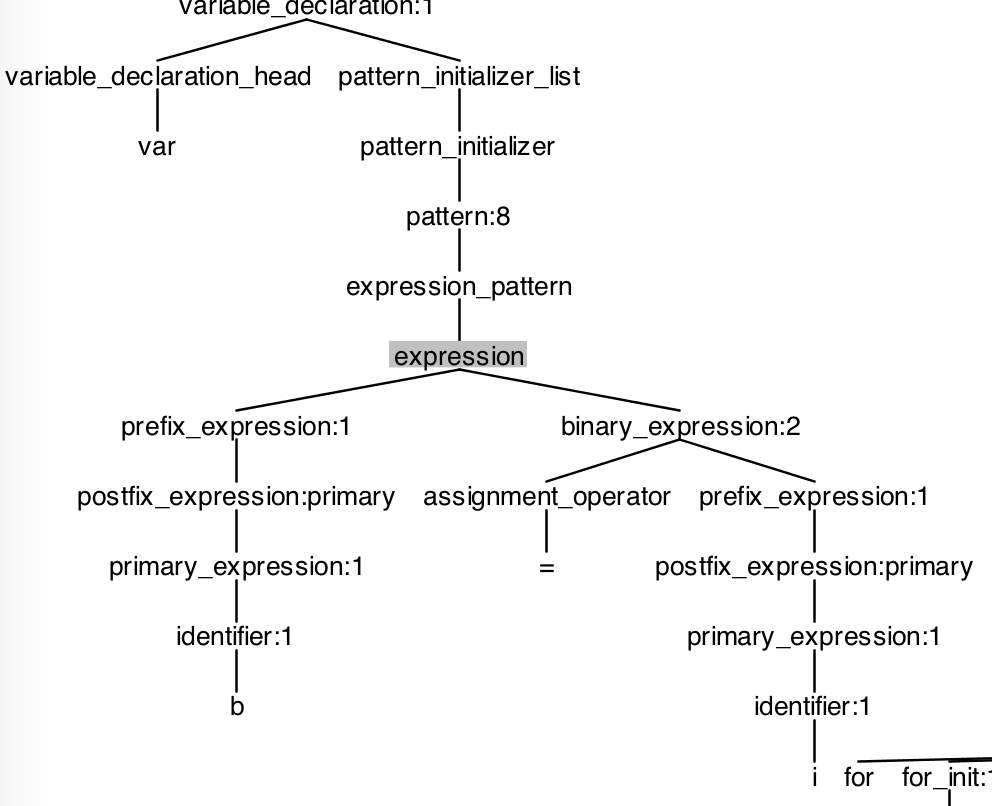
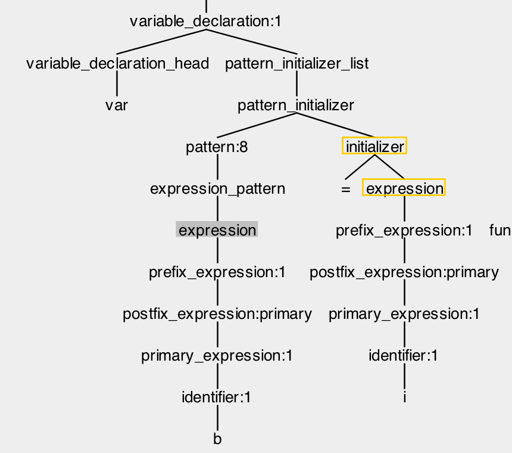
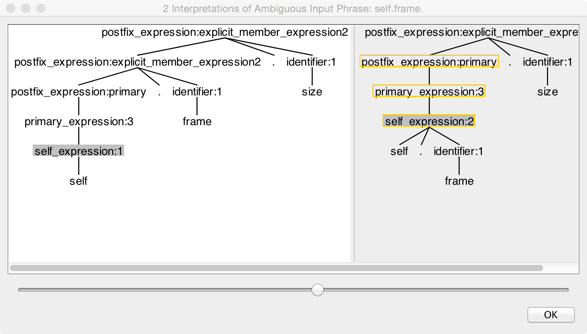
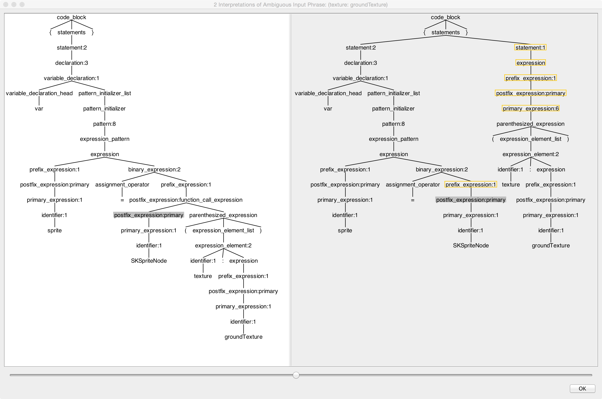

Some notes on issues am finding with the official grammar as I developed the executable grammar.

## Ambiguities

primary-expression → implicit-member-expression­
implicit-member-expression → .­ identifier­

but postfix_expression can match as explicit member too.

```
pattern → wildcard-pattern­type-annotation­opt­
pattern → identifier-pattern­type-annotation­opt­ <- should be not optional as expr case handles
pattern → value-binding-pattern­
pattern → tuple-pattern­type-annotation­opt­
pattern → enum-case-pattern­
pattern → type-casting-pattern­
pattern → expression-pattern­
```

5/29/15: trying now with ambig tree viewer in 1.7 plugin beta.

Couldn't figure out why 2.0 after '<' was an error token:

```Swift
class T {
    func foo() {
        for var i:CGFloat = 0; i < 2.0 + self.frame.size.width / ( groundTexture.size().width * 2.0 ); ++i {
            var sprite = SKSpriteNode(texture: groundTexture)
        }
    }
}
```

parse tree shows primary_expression:1 

```ANTLR
primary_expression
   : identifier generic_argument_clause?
   ;
```

that ain't right. 

wait. the < has no type in popup.  Ah. that means < should be &lt; bug in tool. hang on.

Now it's clear that < should be Operator.

ok, now for ambiguity upon "= i class" in above snippet. ambig for ()* decision.

expression : prefix_expression binary_expression* ;

hard to handle since it falls off end of expr.
It's ambig to match just b to prefix_expression and fall out or match all of b=i.
Two big trees appear but diff shows just a few nodes!



versus



first interp (chosen) says b = i is an assignment expr.

Another ambig shows I should reorder

```ANTLR
self_expression
 : 'self'
 | 'self' '.' identifier
 | 'self' '[' expression ']'
 | 'self' '.' 'init'
 ;
```

so 'self' is last, matching as much as we can here.



next, (texture: groundTexture) can match two interps.



It chooses postfix_expr:function_call_expression over postfix_expr:function_call_expression:primary,
which is good as the (...) shouldn't be interpreted as another statement.
The precedence makes it seem first alt, primary, should be taken but it's not just 
precedence taken into consideration.
It's that f(...) matches the rule by taking the postfix_expr:function_call_expression option.

11/18/15. Error in published grammar; some types are optional here:

```
parameter → let­opt­external-parameter-name­opt­local-parameter-name­ type-annotation ­default-argument-clause­opt­
parameter → var­external-parameter-name­opt­local-parameter-name­ type-annotation ­default-argument-clause­opt­
parameter → inout­external-parameter-name­opt­local-parameter-name­ type-annotation­
parameter → external-parameter-name­opt­local-parameter-name­ type-annotation­...
```

should be:

```
parameter
 : 'let'?  external_parameter_name? local_parameter_name type_annotation? default_argument_clause?
 | 'var'   external_parameter_name? local_parameter_name type_annotation? default_argument_clause?
 | 'inout' external_parameter_name? local_parameter_name type_annotation
 |         external_parameter_name? local_parameter_name type_annotation range_operator
 ;
```

Ambiguity in expression with !?

```ANTLR
postfix_expression
 : postfix_expression postfix_operator                            # postfix_operation
 | postfix_expression parenthesized_expression                    # function_call_expression
 | postfix_expression parenthesized_expression? trailing_closure  # function_call_with_closure_expression
 | postfix_expression '.' 'init'                                  # initializer_expression
 | postfix_expression '.' Pure_decimal_digits                     # explicit_member_expression1
 | postfix_expression '.' identifier generic_argument_clause?     # explicit_member_expression2
 | postfix_expression '.' 'self'                                  # postfix_self_expression
 | postfix_expression '.' 'dynamicType'                           # dynamic_type_expression
 | postfix_expression '[' expression_list ']'                     # subscript_expression
// ! is a postfix operator already
//| postfix_expression '!'                                        # forced_value_expression
// ? is a postfix operator already
// | postfix_expression '?'                                       # optional_chaining_expression
 | primary_expression                                             # primary
 ;
```

missing ',' in apple grammar.
This didn't match `let dataProvider = dataProvider, lineData = dataProvider.lineData`

```ANTLR
optional_binding_condition
 : optional_binding_head optional_binding_continuation_list? where_clause?
                         ^ whoops! must have comma
 ;
```

added comma here:

```ANTLR
optional_binding_continuation_list
 : ',' optional_binding_continuation (',' optional_binding_continuation)*
 ;
```